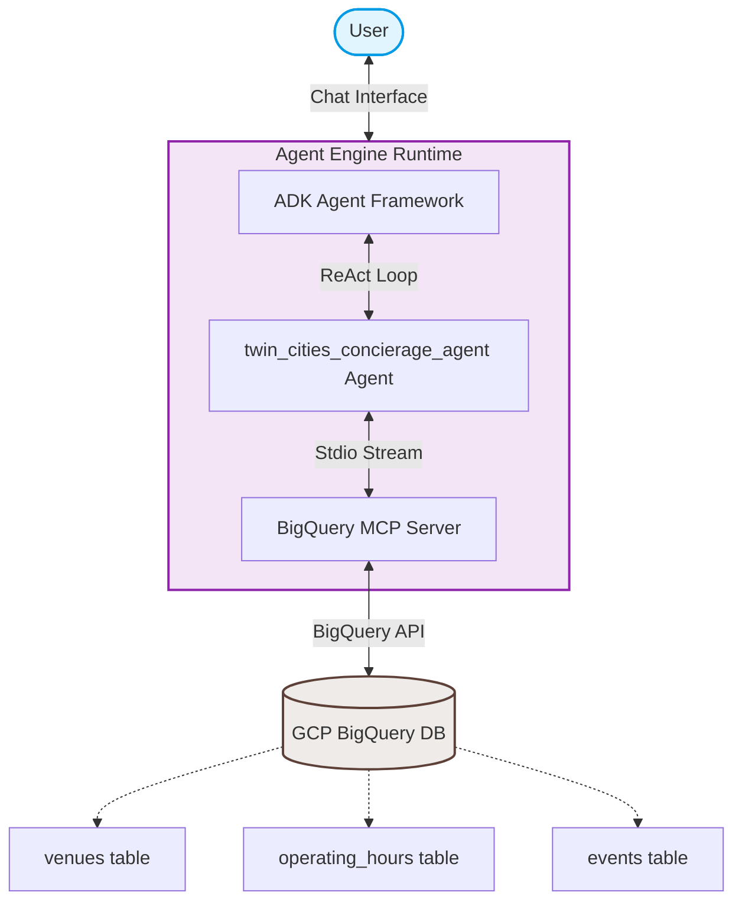
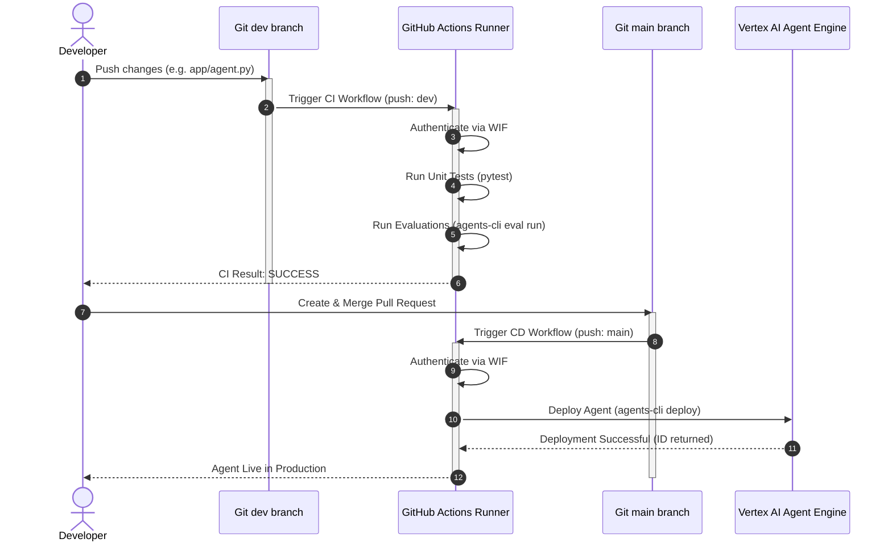

# 🤖 twin-cities-concierage-agent

An expert, friendly local concierge agent for the Minneapolis-Twin Cities area. It helps users plan the perfect day or night out, specializing in coffee shops, casual bars, and live jazz venues. 

The agent operates in a **ReAct loop**, writing and executing SQL queries to verify venue operating hours, location details, and live music schedules in real-time from a **Google Cloud BigQuery** database using a custom **Model Context Protocol (MCP)** connection.

---

## 🏗️ System Architecture

The following diagram illustrates how the user, the Vertex AI Agent Engine, the Python ADK framework, the Stdio-based MCP server, and BigQuery interact:



---

## 🚀 DevOps CI/CD Pipeline

The project features a full DevOps CI/CD pipeline built on **GitHub Actions** and secured via **Workload Identity Federation (WIF)**, eliminating the need to store static GCP service account keys in GitHub.

### Pipeline Workflow Strategy:
1. **Continuous Integration (CI) on `dev`**: 
   - Every push to the `dev` branch triggers the test pipeline.
   - It authenticates to GCP, spins up the environment, and runs automated unit tests and agent evaluations (`agents-cli eval run`).
   - This ensures that code changes are fully validated before any merge request can be created.
2. **Continuous Delivery (CD) on `main`**:
   - Once tests are successful and the pull request is merged into the `main` branch, the deployment pipeline is triggered.
   - It packages and deploys the agent code to the Vertex AI Reasoning Engine on GCP.

### CI/CD Pipeline Flow:



---

## 📂 Project Structure

```
twin-cities-concierage-agent/
├── .github/workflows/         # CI/CD workflows (ci.yml)
├── app/                       # Core agent implementation
│   ├── agent.py               # Persona instructions & tool definitions
│   ├── tools.py               # MCP BigQuery toolset configuration
│   ├── mcp_server.py          # Stdio-based Model Context Protocol server
│   └── agent_runtime_app.py   # ADK entrypoint application logic
├── deployment/                # Environment infrastructure
│   └── terraform/             # IaC definitions (WIF, datasets, sinks)
├── tests/                     # Validation suite
│   ├── unit/                  # Local configuration unit tests
│   └── eval/                  # Persona-based agent evaluation cases
├── agent                      # Wrapper script for CI/CD commands
└── agent.yaml                 # Deployment manifest parameters
```

---

## 🛠️ Commands Cheat Sheet

| Action | Command | Description |
| :--- | :--- | :--- |
| **Install** | `agents-cli install` | Syncs virtual environment dependencies |
| **Playground** | `agents-cli playground` | Launches local interactive agent UI |
| **Run Evals** | `./agent test` | Evaluates agent persona against test sets |
| **Deploy** | `./agent deploy` | Deploys the local agent to Vertex AI Agent Engine |
| **IaC Provision** | `agents-cli infra cicd` | Provisions GCP WIF infrastructure and registers secrets |
