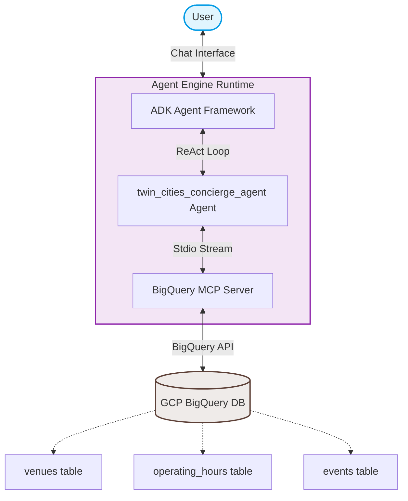
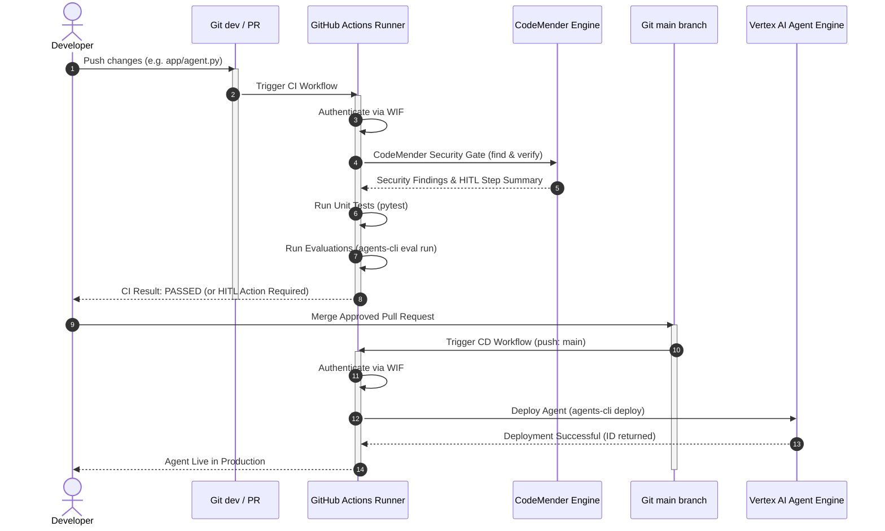

# 🤖 twin-cities-concierge-agent

An expert, friendly local concierge agent for the Minneapolis-Twin Cities area. It helps users plan the perfect day or night out, specializing in coffee shops, casual bars, and live jazz venues. 

The agent operates in a **ReAct loop**, writing and executing SQL queries to verify venue operating hours, location details, and live music schedules in real-time from a **Google Cloud BigQuery** database using a custom **Model Context Protocol (MCP)** connection.

---

## 🏗️ System Architecture

The following diagram illustrates how the user, the Vertex AI Agent Engine, the Python ADK framework, the Stdio-based MCP server, and BigQuery interact:


```mermaid
graph TD
    User([User]) <-->|Chat Interface| AE[Vertex AI Agent Engine]
    subgraph AE [Agent Engine Runtime]
        ADK[ADK Agent Framework] <-->|ReAct Loop| Agent[twin_cities_concierge_agent Agent]
        Agent <-->|Stdio Stream| MCP[BigQuery MCP Server]
    end
    MCP <-->|BigQuery API| BQ[(GCP BigQuery DB)]
    BQ -.-> V[venues table]
    BQ -.-> O[operating_hours table]
    BQ -.-> E[events table]
    
    style User fill:#e1f5fe,stroke:#039be5,stroke-width:2px
    style AE fill:#f3e5f5,stroke:#8e24aa,stroke-width:2px
    style BQ fill:#efebe9,stroke:#5d4037,stroke-width:2px
```

---

## 🚀 DevOps CI/CD Pipeline

The project features a full DevOps CI/CD pipeline built on **GitHub Actions** and secured via **Workload Identity Federation (WIF)**, eliminating the need to store static GCP service account keys in GitHub.

### Pipeline Workflow Strategy:
1. **Continuous Integration (CI) on `dev` (Advisory / Audit Mode)**: 
   - Every push to `dev` triggers the automated validation pipeline.
   - Runs the **CodeMender Security Gate in Audit Mode** (surfacing findings, PoC traces, and remediation diffs in `$GITHUB_STEP_SUMMARY` without breaking the build), followed by unit tests and agent evaluations.
   - Allows developers to iterate rapidly while maintaining full security visibility.
2. **Quality Gate & Continuous Delivery (CD) on `main` (Strict Blocking Gate)**:
   - Any pull request targeting `main` or push to `main` enforces the **Strict Blocking Gate** (`--fail-on-findings`).
   - If unreviewed vulnerabilities exist, the pipeline halts immediately, blocking unit tests, evals, and deployment until a human reviews and mends the code.
   - Once all gates pass and the pull request is merged, the agent is deployed to the Vertex AI Reasoning Engine on GCP.

### CI/CD Pipeline Flow with CodeMender:


```mermaid
sequenceDiagram
    autonumber
    actor Developer
    participant GitDev as Git dev / PR
    participant GHA as GitHub Actions Runner
    participant CM as CodeMender Engine
    participant GitMain as Git main branch
    participant AE as Vertex AI Agent Engine

    Developer->>GitDev: Push changes (e.g. app/agent.py)
    activate GitDev
    GitDev->>GHA: Trigger CI Workflow
    activate GHA
    GHA->>GHA: Authenticate via WIF
    GHA->>CM: CodeMender Security Gate (find & verify)
    CM-->>GHA: Security Findings & HITL Step Summary
    GHA->>GHA: Run Unit Tests (pytest)
    GHA->>GHA: Run Evaluations (agents-cli eval run)
    GHA-->>Developer: CI Result: PASSED (or HITL Action Required)
    deactivate GHA
    deactivate GitDev

    Developer->>GitMain: Merge Approved Pull Request
    activate GitMain
    GitMain->>GHA: Trigger CD Workflow (push: main)
    activate GHA
    GHA->>GHA: Authenticate via WIF
    GHA->>AE: Deploy Agent (agents-cli deploy)
    AE-->>GHA: Deployment Successful (ID returned)
    GHA-->>Developer: Agent Live in Production
    deactivate GHA
    deactivate GitMain
```

---

## 🛡️ CodeMender Dev Workflow & HITL Review Gate

[CodeMender](https://deepmind.google) is an autonomous, AI-driven security and remediation agent developed by Google DeepMind and delivered via the Gemini Enterprise Agent Platform. It proactively eliminates security vulnerabilities in MCP tools and BigQuery SQL queries before they can reach production.

### Workflow Stages:
1. **Discovery (`cm find`)**: Scans agent tools and database callers using Gemini-powered static analysis to detect vulnerabilities (such as SQL injection, unvalidated ReAct execution paths, and secret leaks).
2. **Sandbox PoC Verification (`cm verify`)**: Synthesizes and executes a safe proof-of-concept (PoC) exploit in an isolated sandbox to confirm genuine exploitability, eliminating false positives.
3. **Autonomous Patch Synthesis (`cm fix`)**: Synthesizes an idiomatic security fix and automatically runs the unit test suite (`uv run pytest tests/unit`) in the sandbox to ensure no functional regressions are introduced.
4. **Human-in-the-Loop (HITL) Review**:
   - **Locally**: Prompts the developer (`[Y/n]`) in the terminal before applying changes to the working tree.
   - **In GitHub Actions**: Generates a rich Markdown audit report directly in the GitHub **Job Summary** (`$GITHUB_STEP_SUMMARY`) displaying vulnerability details, PoC analysis, and the proposed remediation diff for maintainer sign-off.
5. **Unit & Regression Testing**: Runs `pytest` to guarantee all contracts and persona configs remain intact.
6. **Deployment Gate**: Only when CodeMender and all test suites pass does the pipeline allow deployment to the Vertex AI Reasoning Engine.

### Running the Workflow Locally:
```bash
# 1. Run the interactive end-to-end demo (Scan -> PoC -> HITL Prompt -> Unit Tests)
./agent review

# 2. Or run specific CodeMender operations
./agent mender find         # Scan codebase for security vulnerabilities
./agent mender verify       # Run isolated sandbox PoC exploit verification
./agent mender fix          # Synthesize patch and run regression tests
```

---

## 📂 Project Structure

```
twin-cities-concierge-agent/
├── .github/workflows/         # CI/CD workflows (ci.yml with CodeMender gate)
├── app/                       # Core agent implementation
│   ├── agent.py               # Persona instructions & tool definitions
│   ├── tools.py               # MCP BigQuery toolset configuration
│   ├── mcp_server.py          # Stdio-based Model Context Protocol server
│   └── agent_runtime_app.py   # ADK entrypoint application logic
├── deployment/                # Environment infrastructure
│   └── terraform/             # IaC definitions (WIF, datasets, sinks)
├── scripts/                   # Workflow scripts
│   └── codemender.py          # CodeMender CLI orchestrator & HITL demo engine
├── tests/                     # Validation suite
│   ├── unit/                  # Local configuration & CodeMender unit tests
│   └── eval/                  # Persona-based agent evaluation cases
├── agent                      # Wrapper script for CI/CD commands
└── agent.yaml                 # Deployment manifest parameters
```

---

## 🛠️ Commands Cheat Sheet

| Action | Command | Description |
| :--- | :--- | :--- |
| **CodeMender Review** | `./agent review` | Runs interactive CodeMender security review & HITL demo |
| **CodeMender CLI** | `./agent mender [cmd]` | Runs `find`, `verify`, or `fix` security operations |
| **Unit Tests** | `uv run pytest tests/unit` | Runs local configuration and CodeMender unit tests |
| **Install** | `agents-cli install` | Syncs virtual environment dependencies |
| **Playground** | `agents-cli playground` | Launches local interactive agent UI |
| **Run Evals** | `./agent test` | Evaluates agent persona against test sets |
| **Deploy** | `./agent deploy` | Deploys the local agent to Vertex AI Agent Engine |
| **IaC Provision** | `agents-cli infra cicd` | Provisions GCP WIF infrastructure and registers secrets |
